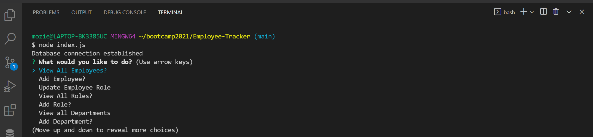
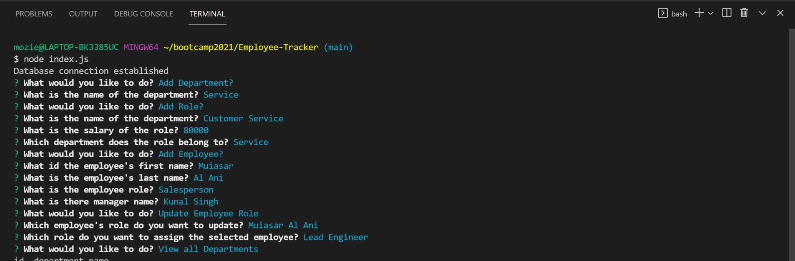
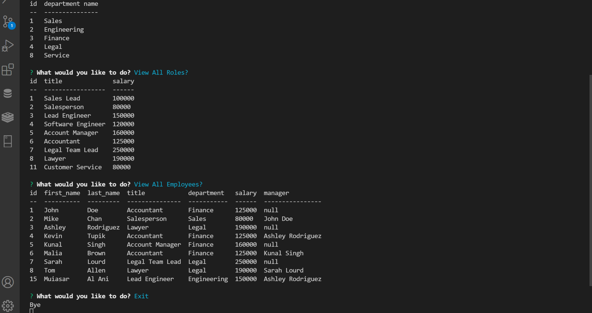
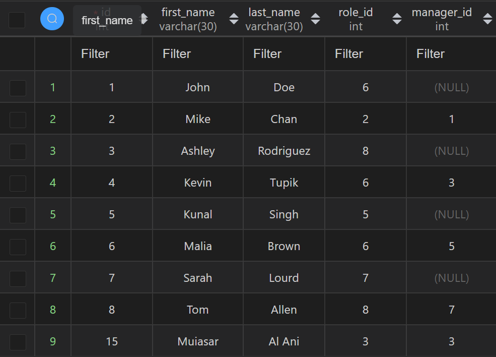
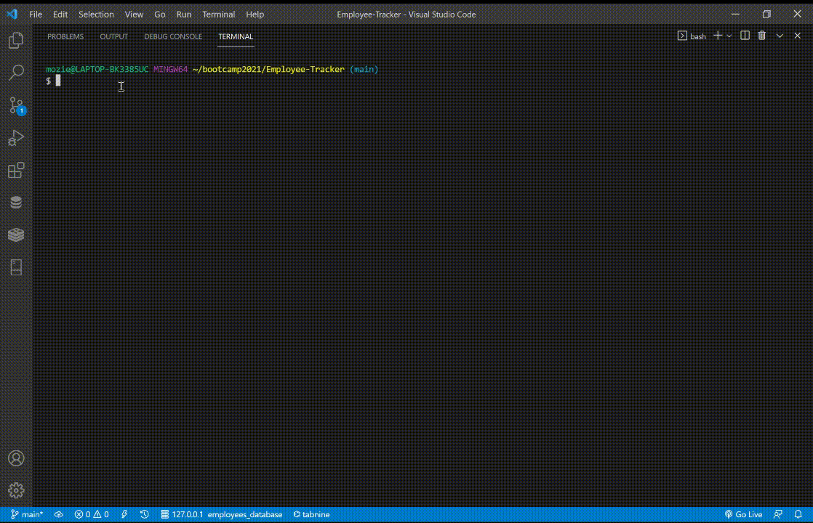

# Back-End Employee Tracker 

## Table of Contents

- [Description](#description)
- [Licenses](#licenses)
- [Installation](#installation)
- [Usage](#usage)
- [Technologies](#technologies)
- [Screen shots](#screen-shots)
- [Credits](#credits)
- [Contributions](#contributions)
- [Questions](#questions)


## Description : 
This is a Back-End Employee Tracker that was created using a SQL database with MySQL, and used inquirer npm package to get the user input and manipulate the database based on that input. The User can add a new employee to the database, add new role, add new department, view all departments stored on the database, view all employees, view all Roles and more.

## Licenses :
[](https://opensource.org/licenses/MIT)


## Installation : 
To install the Back-End Employee Tracker  App use the instructions bellow &#8595;
```
npm install
```


## Usage : 
After installation User can run the `node index.js` command in the terminal and can add a new employee to the database, add new role, add new department, view all departments stored on the database, view all employees, view all Roles and more.


## Technologies : 

- JavaScript.
-  Node.js.
-  SQL.
-  MySQL
-  MySQL2 npm package.
-  Promise-sql npm package.
-  Console.table npm package.
-  Inquirer npm package.


## Screen shots : 
### Here are screen shots of my deployed Back-End Employee Tracker  App!


[The Demo Video](https://drive.google.com/file/d/14HB1rXvERIb_c1iKhGUmEC6ZifRuBW5R/view?usp=sharing)



## Credits :

- [Muiasar-Al-Ani](https://github.com/Muiasar-Al-Ani)


## Contributions :
    Contributions, issues, and feature requests are welcome!
    Give a ⭐️ if you like this project!


## Questions : 
If you have any Question please feel free to contact me:
- muiasar2012@gmail.com
- [Muiasar-Al-Ani](https://github.com/Muiasar-Al-Ani)


&copy; 2021 [Back-End Employee Tracker ](https://github.com/Muiasar-Al-Ani)
